# Labsheet 1: Basics of the Linux command line in POSIX systems

___

## Objectives

1. To understand the basics of command line terminal in POSIX systems,
2. To connect to a remote client via network connection

## Theory  
  
The command line is one of the most useful and important interfaces in any computer system. Bash is the most commonly used shell interface in POSIX systems, such as Linux and macOS. The _shell_ interface for UNIX interfaces operate outside the kernel, just like a shell in nature, allowing human interaction with the computer. Bash is a full-fledged application that is used to start and run applications, create files and directories, manage permissions and run basic operating system level activities. There are other alternatives to bash, including zsh, fish, dash, rc, etc that work across Linux, macOS and BSD systems.

Despite bash being only supported on POSIX systems, we can access it on any OS, including Windows, via a remote shell connection to the said system. For this, we will use the samba server (or PuTTY on Windows).

## Activity

### Accessing the server connected to the network via the terminal on macOS

macOS has a built-in terminal that runs zsh (for newer versions) or bash out of the box. This terminal has SSH built into it - no need to download additional clients for connecting remotely to other computers. For this,

1. `⌘ + space` to launch spotlight, search for `terminal`,
2. Once terminal opens up, we enter the command `ssh user@ip-address`, where `user` is the username to be used in the remote system, and `ip-address` is the IP address of the remote system.
3. Once we enter the necessary username and password, we have access to the remote system.

### Connecting Mac and Windows with file sharing

   1. A folder is created in the PC, that is to be shared across the network with other computers. This folder is shared via the `Give access to > Specific people` menu.

       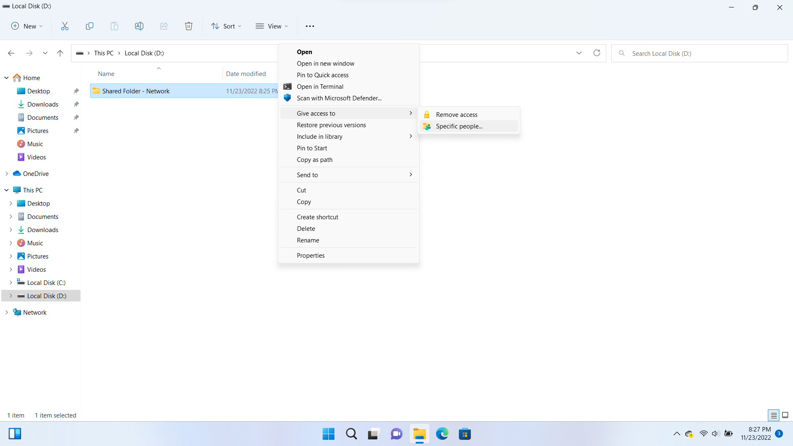

   2. `Everyone` is selected in the `Choose people to share with` dialog.

       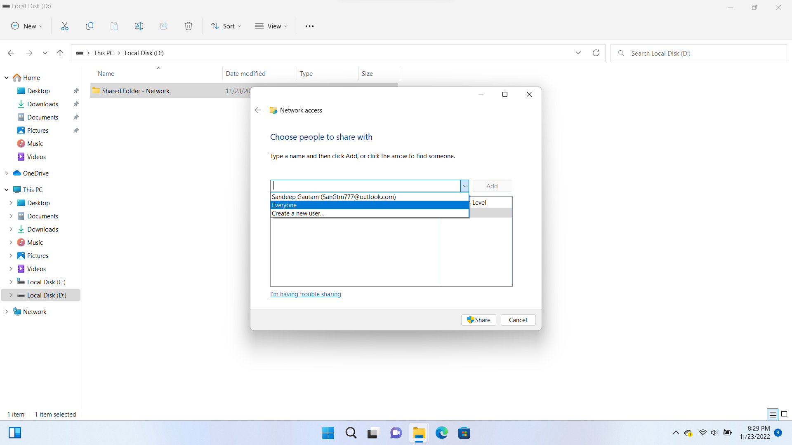

   3. The folder has been shared successfully, across the Samba Server.

       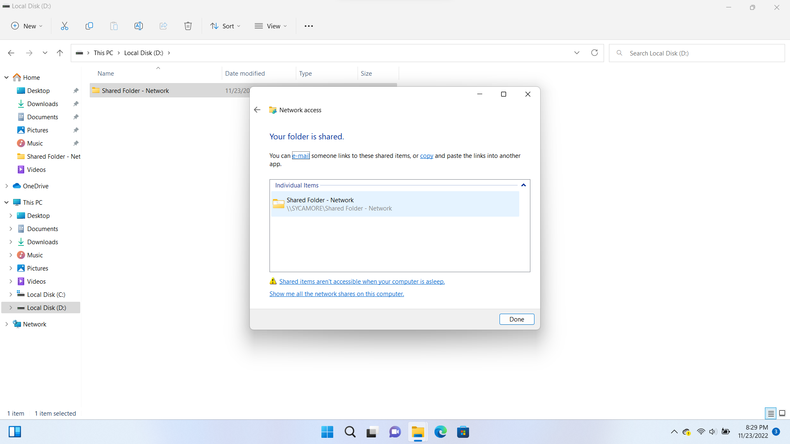

   4. Next, we open the command prompt via `Windows + Run > cmd` option. In the command prompt terminal, we enter the `ipconfig` command to view the IPv4 of the PC. This IPv4 is necessary to connect via the other computer. We note it down.

       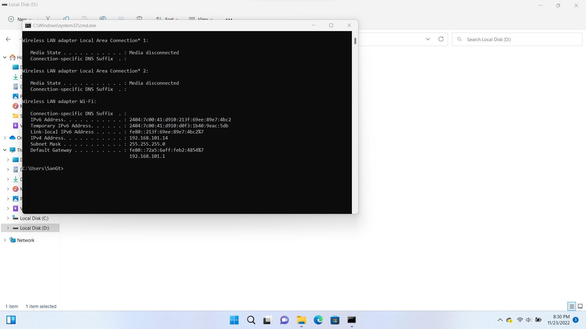

   5. Now, we open the Mac and connect it to the same network as the PC. In `Finder` application, we press `⌘ + k` button to open the `Connect to server` interface. We enter the IPv4 of the PC that we noted earlier in the format `smb://192.168.101.14` and enter connect.

       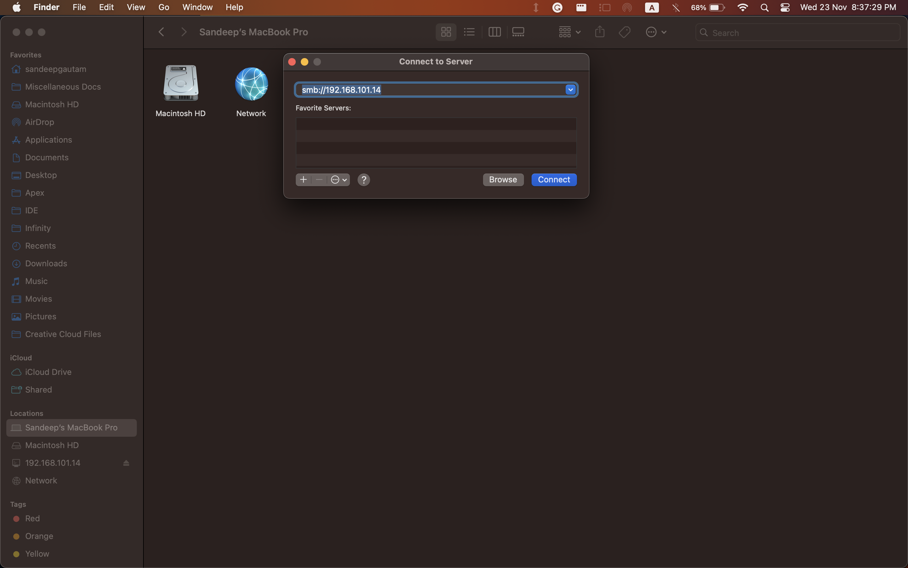

   6. The dialog asks for the username and password of the PC. Since our PC is in Windows 11, we will have to enter the Microsoft account's username and password. For older versions of Windows, using the Windows username and login password is enough.

       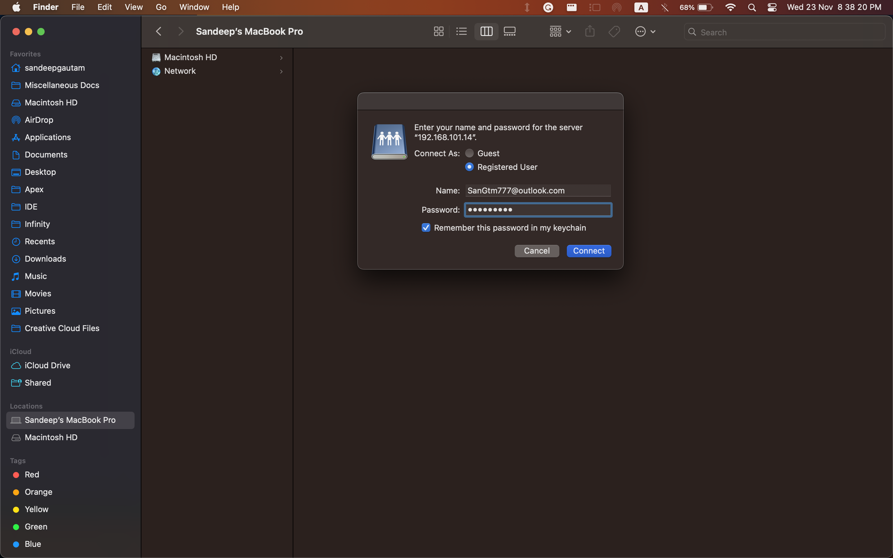

   7. The folder has been shared successfully. Now, we can upload any document across both PC and Mac and have it access both ways.

       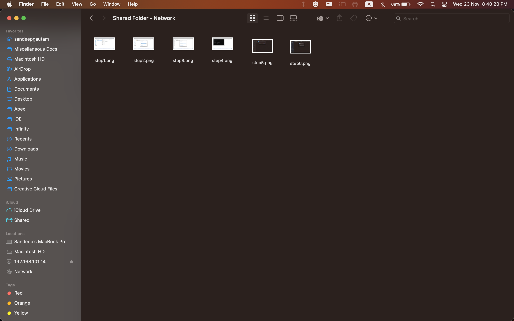

___

### Sharing a folder in Mac to other PCs and Macs

   1. In our Mac, we go to `System Settings -> General -> Sharing -> File Sharing`. We turn on the `File Sharing` toggle, which asks for fingerprint auth. Once we are authenticated, the sharing is enabled.

       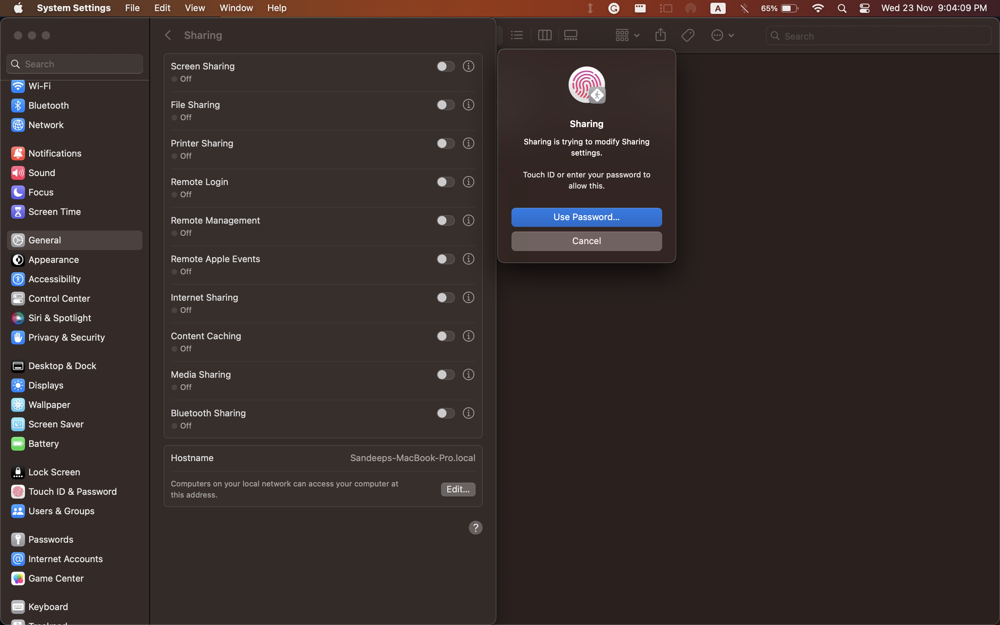

   2. We click on the info button besides `File Sharing`, and click on `Options`. We select our public folder to be shared, which in turn asks for the password of Mac to authenticate the user. We enter the password, and are verified. Now, we can share our folder.

       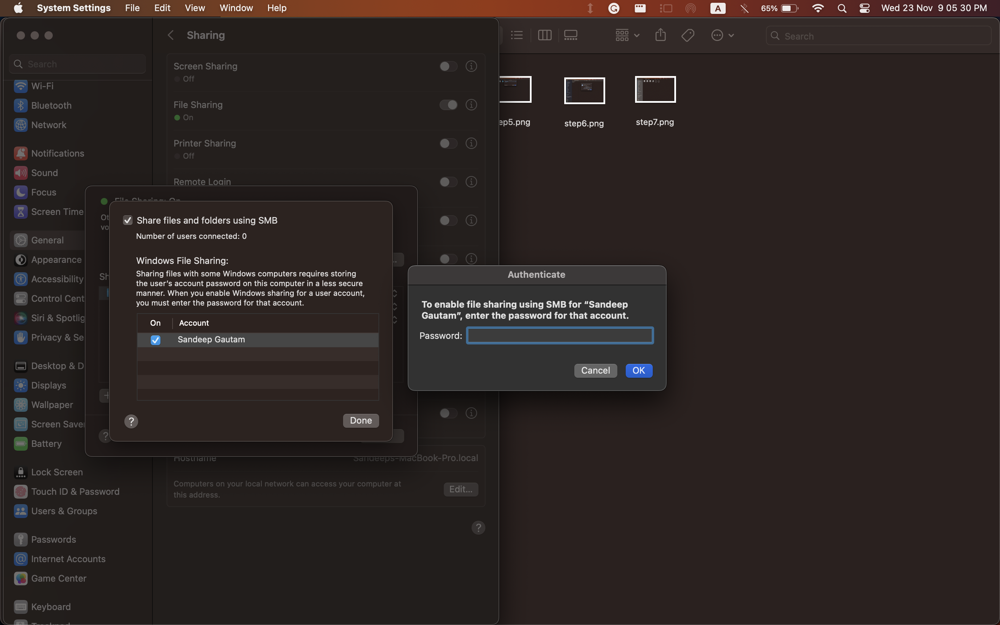

   3. We click on the WiFi icon while holding the `⌥` button, which displays us the IP address of the Mac.

       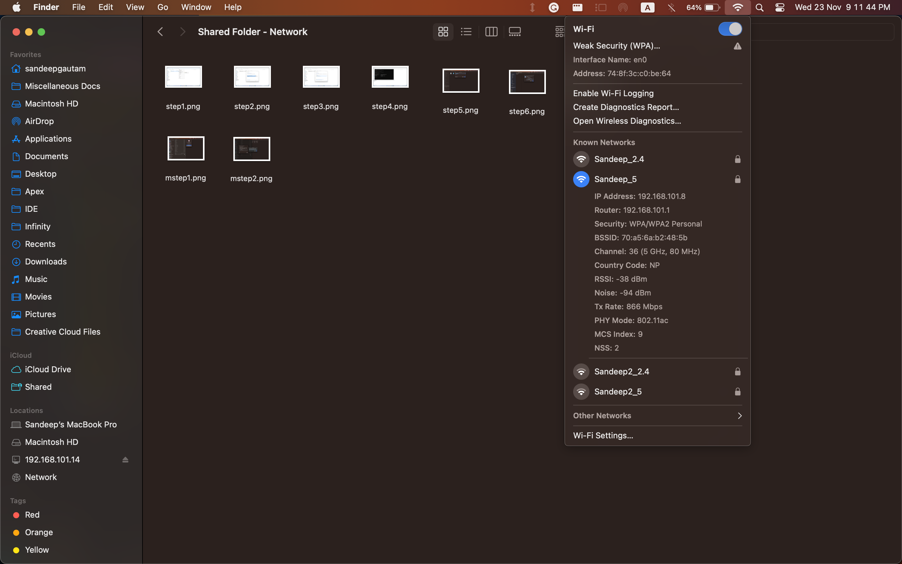

   4. Now, we click `Windows + R` on the PC, and enter `//192.168.101.8`, which is the IP address of the Mac.

       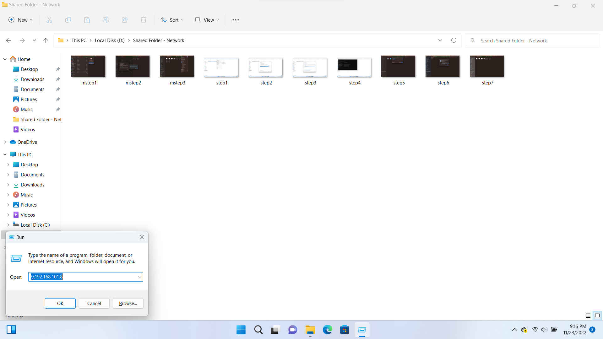

   5. The dialog box asks for the username and password of the Mac's account. Once this is verified, we can access all the folders of the shared user's Macintosh HD.

       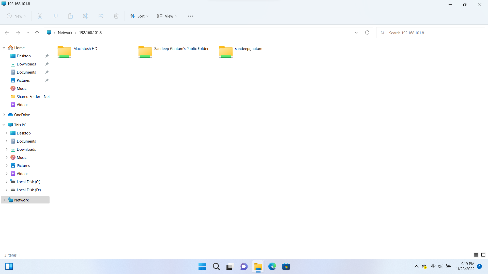

## Observation and Conclusion

Hence, we observed and learnt how to connect a Mac and a PC to each other via SSH connection and via the use of samba server for file sharing.
